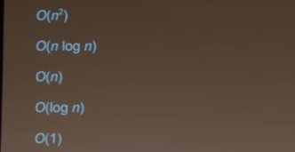

# Notations
<div align="center"></div>

## **Big O** notation - **O**
Para representar o tempo de execução de um algoritmo, o numero de passos que ele deu. O limite superior, ou seja, o máximo de passos ou perto disso.
## **Big Ômega** notation - **Ω**
Igual o Big O, Mas é usado para descrever um limite inferior no tempo de execução de um algoritmo, enquanto o Big O é para o limite superior (quantos passos o algoritmo pode dar).

Quantos passos meu algoritmo pode dar? 
   
   O Melhor caso.
## **Big Theta** notation - **Θ**
Usado quando o limite superior no tempo de execução é o mesmo ao limite inferior

# Searchs

## **Linear Search**
Na teoria, consiste em vasculhar um array (ou algo do tipo) item por item procurando um item específico.
```c
/* Vasculha em cada elemento procurando pelo int 0 */
int main(void){
    int numbers[] = {1,5,2,8,4,0,3};
    for (int i = 0; i < 7; i++){
        if (numbers[i] == 0) {
            printf("Encontrado\n");
            return 0;            
        }
    }
    printf("Não encontrado\n");
    return 1;
}

```
O tempo de execução desse algoritmo é dependente do tamanho do array, ou seja, no limite mais superior: $O(n)$.

Mas, e se tiver sorte e o array for assim? `int intarray[] = {0,4,6,7,1,8};` Agora, estamos em um limite mais inferior, ou seja, usamos a notação Ômega, $Ω(1)$.

## **Binary Search**
Considerando a busca em um numero em um array em ordem crescente `{1,2,3,4,5,6,7}`, podemos usar a busca binária, aqui vai um exemplo em pseudo-código:
```
if (sem item)
    retorne false

if (numero == item do meio)
    retorne true

else if (numero < item do meio)
    procure à metade da esquerda

else if (numero > item do meio)
    procure à metade da direita
```
Esse algoritmo representado na notação big O fica $O(log~~n)$ sendo *log* o *logaritmo* que significa o número de vezes que você pode dividir $n$ por $2$. E no melhor caso, aonde o algoritmo encontraria o número de primeira, a notação em big ômega ficaria $Ω(1)$ também.
É importante não depender da sorte e considerar a velocidade do algoritmo  no melhor caso. Por isso usamos a notação do big O.


# Structs

Em uma situação aonde precisamos armazenar dados que se interligam, podemos usar estruturas de dados. Um exemplo para armazenar nomes e números de telefones sem essa interligação:
```c
char *nomes = {"Ana", "Bob"};
char *numeros = {"4002-8922", "1234-5678"};
for (int i = 0; i<2; i++)
{
    printf("Contato %s tem o número %s\n", nomes[i], numeros[i]);
}
```
Funciona? Sim. Mas eventualmente isso pode quebrar totalmente o código. Por isso podemos definir uma estrutura.
```c
typedef struct
{
    char *nome;
    char *numero;
}
contato;
```
Então aqui definimos uma estrutura de dados com o nome de `contato`. Isso é parecido com uma classe na orientação a objetos, mas C não é orientado a objetos, lembre-se que classes armazenam valores e funções, essas estruturas armazenam apenas valores. 

Isso que fizemos de interligar dados é chamado de **encapsulamento**.

Aqui vamos definir um array com espaço para dois contatos, em seguida adicioná-los, e por fim listá-los.
```c
contato contatos[2];
contatos[0].nome = "Ana";
contatos[0].numero = "4002-8922";
contatos[1].nome = "Bob";
contatos[1].numero = "1234-5678";
for (int i = 0; i < 2; i++)
{
    printf("Contato %s tem o número %s\n", contatos[i].nome, contatos[i].numero);
}
```

# Sort
Voltando ao assunto sobre as pesquisas, vimos que a pesquisa binária é mais rápida para dados que estão ordenados. Vamos ver agora maneiras de ordenar dados.

Essa é nossa função principal, ela tem dois arrays com valores iguais, um para cada método de ordenação.
```c
int main(void) {
    int array[] = {2,4,1,7,3,0};
    int array2[] = {2,4,1,7,3,0};
    printf("Selection Sort\n");
    selectionSort(array);
    printf("Bubble Sort\n");
    bubbleSort(array2);
    return 0;
}
```
## **Selection Sort**
Seleciona os menores valores repetidamente, da esquerda para a direita. Qual seria o melhor caso? Bom, mesmo se o array ja estiver ordenado, ele vai continuar vendo se tem um número menor que o número guardado na variável menor, então aqui temos esse caso:

No limite superior: $O(n^2)$ 

E no limite inferior: $Ω(n^2)$

Ou seja, o limite superior é igual ao inferior. Então representamos a notação desse algoritmo como $Θ(n^2)$,
```c
void selectionSort(int array[]){
    int array[] = {2,4,1,7,3,0};
    int menor; // iniciamos a variável 'menor'
    for (int z = 0; z < 6; z++){ 
        menor = array[z]; // 'menor' vai começar com o valor do indíce do array
        for (int i = 0+z; i < 6; i++){  // começamos outro for, mas o indice (variavel 'i') começa com 0 + o indice atual (z)

            if (array[i] < menor) { // comparamos a varíavel 'menor' com um elemento

                // aqui temos uma troca de valores, então

                menor = array[i]; // o menor passa a ser esse elemento
                array[i] = array[z]; 
                array[z] = menor;

                /* exemplo:
                    se o array[z] estiver em 4, a posição dele (1) vai passar a ser 1
                    e a posição da onde estava o 1 (2) passa a ser 4
                */

            }
        }
    }
    for (int i = 0; i<6;i++){
        printf("%d < ", array[i]);
    }
}
```
Array original: `{2,4,1,7,3,0}`

Saída do código: `0 < 1 < 2 < 3 < 4 < 7`
## **Bubble Sort**

Também da esquerda para direita, esse algoritmo vai repetidas vezes comparar `i` e `i+1`, trocando-os de lugar caso a condição for verdadeira. Exemplo: temos um array com os valores `{1,4,2}`, ele vai primeiramente comparar se 1 é maior que 4, se sim ele muda, como não é agora ele vai comparar 4 maior que 2, como é agora o array está `{1,2,4}`. Certo, como teve uma troca o algoritmo vai tentar de novo, ele vai ver comparar 1>2 e 2>4 que não resultará em nenhuma troca, ou seja, ele finaliza.

Esse algoritmo consegue se sobressair nos melhores casos.

No limite superior: $O(n^2)$ 

E no limite inferior (melhor caso): $Ω(n)$

Como temos uma variável de controle, caso nenhum tiver mudado isso quer dizer que o array ja está ordenado.

Vejamos um exemplo.
```c
void bubbleSort(int array[]) {
    bool trocado = false; // variável de controle
    do {
        trocado = false; // a cada interada ela volta a ser false
        for (int i = 0; i < 6 - 1; i++) { // tamanho do array -1 é necessario
            if (array[i] > array[i+1]) { // se o elemento for maior que o próximo
                // eles trocam!
                int tmp = array[i+1];
                array[i+1] = array[i];
                array[i] = tmp;
                trocado = true; // variavel fica true
            } 
        }
    // se a variavel ainda for false o loop acaba
    } while (trocado);

    for (int i =  0; i < 6; i++){
        printf("%d < ", array[i]);
    }
}
```

Array original: `{2,4,1,7,3,0}`

Saída do código: `0 < 1 < 2 < 3 < 4 < 7`

## **Merge Sort**

Esse algoritmo de ordenação funciona de uma maneira um tanto quanto diferente dos já vistos. Ele vai dividindo o array criando sub-arrays e depois juntando e comparando-os. É difícil explicar então fique com este exemplo:

<div align="center"></div>
<a href="https://cs50.harvard.edu/x/2022/shorts/merge_sort/">Aula para ajudar a compreensão.</a>

Esse algoritmo consegue ser mais rápido no limite inferior, com $Θ(log~~n)$, mas no limite superior a ordenação por seleção (Selection Sort) ainda é mais eficiente.