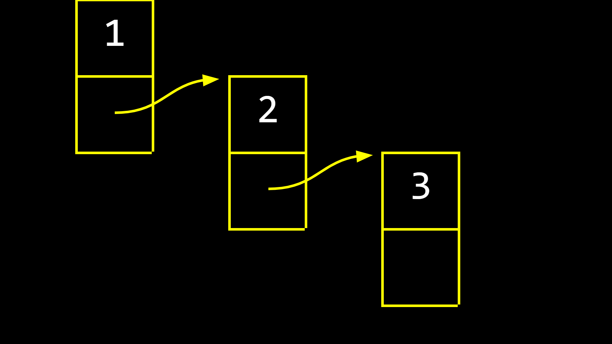

# **Realloc Function**
Em uma situação onte temos um array com 3 de tamanho que precisa de mais um espaço podemos usar a nossa função `malloc` para alocar um novo espaço de memória e depois só copiar o array no novo, como no exemplo abaixo
```c
    // list = {1, 2, 3}

    // aloca um novo espaço na memoria de tamanho 4 
    int *tmp = malloc(4*sizeof(int));

    if (tmp == NULL){
        free(list);
        return 1;
    }

    // guarda os valores atuais da lista no array
    for (int i = 0; i < 3; i++) {
        tmp[i] = list[i];
    }

    // adiciona o novo item
    tmp[3] = 4;
```

Mas com a função `realloc` não precisariamos copiar os valores manualmente novamente, exemplo:
```c
    int *tmp = realloc(list, 4*sizeof(int));

    if (tmp == NULL){
        free(list);
        return 1;
    }

    // adiciona o novo item
    tmp[3] = 4;

```
Essa função vai receber o ponteiro antigo e alocar um novo espaço com o novo tamanho, já copiando os itens para esse espaço.

# **Linked List**
Esse tipo de lista se resume em diversos espaços na memória que apontam para outro espaço. No C, podemos definir uma estrutura para esses nodes (nós), veja:
```c
typedef struct node {
    int value;
    struct *node next;
} node;
```
Nessa, estrutura, temos o nosso valor propriamente dito, e, um ponteiro para aonde está o próximo node da lista.
<hr/>

<p align="center">representação visual de uma linked list.</p>
<hr/>

## E para adicionarmos um novo node?
Simples, primeiro, vamos começar a lista.
```c
node *list = malloc(sizeof(node)); // pedindo memória ao computador com o tamanho do nosso node

// (*list).value = 10; // acessa o node e muda o seu valor
// essa sintaxe é bem estranha, então podemos arrow notation, o resultado é o mesmo.
list->value = 10;
list->next = NULL;
```
Certo, definimos o nosso primeiro node, e, se você perceber, definimos o next como NULL, pois, ainda não temos um próximo node.
Agora, vamos definir outro node agora. Começamos do mesmo modo.
```c
node *n = malloc(sizeof(node));
n->value = 20;
n->next = NULL;
list->next = n; // mudamos o next para o novo node
```
Ok, ficar fazendo isso para cada novo node é realmente chato, podemos criar uma função que faça isso para nós.
```c
/* add node in last position */
void append(node *list, int value) {
    node *tmp = list;

    // get next to last node   
    while (tmp->next != NULL) {
        tmp = tmp->next;
    }

    // change last node (NULL) to a valid node
    node *last_tmp = malloc(sizeof(node));
    tmp->next = last_tmp;
    tmp->next->value = value;
    tmp->next->next = NULL;
}
```
Basicamente, temos um `while` para conseguirmos o penúltimo node da lista (pois o último é nulo). Criamos um novo node, que vai conter o valor passado como parâmetro, e trocamos o `next` do penúltimo node para o nosso novo node.

Podemos também inserir um novo node no começo da lista, nesse caso, no segundo "espaço".

```c
/* add a node in second position */
void insert(node *list, int value) {
    node *tmp = list->next;
    list->next = malloc(sizeof(node));
    list->next->next = tmp;
    list->next->value = value;
}
```
Essa função muda o segundo node para o nosso novo node, e o `next` do novo node vira o node antigo (basicamente, o primeiro ponteiro vai apontar agora para o novo node, e o ponteiro do novo node vai apontar para o antigo, que estava naquela posição).

## E para acessarmos a lista inteira?
Podemos usar uma estrutura de repetição, nesse caso, usei o `for`, vamos iniciar um node temporário que receberá o primeiro node, tudo que está no `for` deverá se repetir enquanto esse node for diferente de `NULL`, e, a cada interagida, a variável vai receber o node seguinte.

```c
// print all values of list
for (node *tmp = list; tmp!=NULL; tmp = tmp->next) {
    printf("%d\n", tmp->value);   
}
```

## E aquele tanto de malloc?
Pois é, precisamos dar `free` naquilo tudo. Podemos fazer o seguinte, dentro de um `while`, enquanto a lista não for nula, guarde em uma variável temporária, o próximo node, depois disso, use o `free` na lista, e faça a lista receber aquela variàvel temporária. Isso fará que você remova sempre o próximo node, até chegar a hora dele ser igual a `NULL`, e o loop parar. Acredito que fica mais fácil vendo o código.

```c
// free all items
while (list != NULL) {
    node *next = list->next;
    printf("removendo: %d\n", list->value);
    free(list); // free the first node
    list = next;
}
```

# **Binary Search Trees**

<p align="center">Árvore de pesquisa binária</p>
<hr>

Árvores! Talvez uma das estruturas de dados mais importantes nesse universo da computação, não é tão difícil entender seu funcionamento, pense em uma árvore genealógica, onde temos o pais, filhos, netos, etc... Uma árvore é nada mais que isso, nesse caso, temos uma binary search tree (árvore de pesquisa binária). 

Você se lembra da pesquisa binária? Pois é, com as *linked lists* nós conseguimos adicionar elementos sem ter que copiar o array todo, mas, perdemos a possibilidade de fazermos a busca binária que tinhamos no array. Com uma binary search tree, podemos fazer pesquisa binária de uma forma semelhante, e com a possibilidade de adicionar novos elementos.

Repare, que o elemento ao lado esquerdo do "pai" (que chamaremos de root/raíz) sempre é menor que ele, e, o elemento ao lado direito, é sempre maior que o root.

O código está [aqui](tree.c) (comentários em inglês para meu aprendizado), use ele para entender como definimos uma árvore simples, de poucos elementos. Aqui, eu só mostrarei a função para pesquisar n\essa árvore.
```c
/* pesquisa binária na árvore */
bool search(node *tree, int value) {
    if (tree == NULL) {
        // a árvore acabou.
        return false;
    }

    // se o valor for menor que o valor da árvore, procure no node da esquerda
    if (value < tree->value) {
        return search(tree->left, value);
    }
    // mas, se o valor for nauir que o valor da árvore, procure no node da direita
    else if (value > tree->value) {
        return search(tree->right, value);
    }
    else {
        // é igual ao valor da arvore
        return true;
    }
}
```